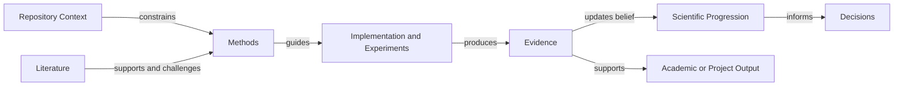

# Owner Documentation Workspace

> **Read this file first.** It is this workspace's AREA MAP: what each area holds, who
> writes it, and what an agent may do with it. The structure is standard across every
> repository; the content is specific to this one.
>
> Retired name — this file absorbed `ownerDocs-Rules.md`, the separate area map that older
> repositories still carry. There is no file by that name here and nothing should look for
> one; this README is where that contract now lives, in full.

## Purpose

`ownerDocs/` is the owner-controlled scientific memory and governance layer of the
repository. It preserves stable context, present status, settled decisions, research inputs,
literature, method evolution, scientific progression, manuscript rules, and independent
review history. It does not duplicate the technical repository map or executable source.

## Precedence

The global operating contract (`~/.claude/CLAUDE.md`) is loaded on every turn in every
repository and is the live authority on language, model routing, delegation, git, and
cross-model execution. **Where anything in this workspace conflicts with it, the global
contract wins.** `myManuscriptRules/` is binding for manuscript work and outranks every
general convention stated here.

This workspace supplies the DOMAIN and the STATE — never the operating rules. A rule about
how to work belongs in the global contract; a rule that appears only here governs nothing.

## Scope and Boundaries

### Owns

- Stable scientific purpose, assumptions, constraints, and expected outputs.
- Current repository state and owner-facing next actions.
- Settled decisions and their rationale.
- Owner-provided research inputs and scoped work units.
- Literature metadata, verification states, and corpus syntheses.
- Method specifications and validation plans.
- Append-only scientific progression and independent review records.
- Binding manuscript-writing rules.

### Does Not Own

- Current file, class, function, or dependency inventories.
- Runtime configuration values.
- Executable implementation or test code.
- Generated experiment outputs.
- Public installation and usage documentation.

## Inputs and Outputs

| Direction | Item | Source or Consumer | Contract |
|---|---|---|---|
| Input | Owner context and constraints | Owner | Preserved without silent reinterpretation |
| Input | Verified run evidence | `artifacts/` | Referenced by path; not copied here |
| Input | Source metadata and PDFs | Owner and literature workflow | Manifested and verification-labelled |
| Output | Scientific context | Agents and reviewers | Canonical repository-specific research context |
| Output | Decisions and progression | Future sessions | Stable IDs and append-only history |
| Output | Method and review records | Implementation and manuscript workflows | Traceable specifications and findings |

## Structure and Key Elements

Writer assignment is owner directive, 2026-08-17. It is DATA in `scripts/repo_scaffold.py`
(`OWNER_AUTHORED` / `CLAUDE_AUTHORED` / `NEVER_WRITE`) with a self-test asserting the three sets
are disjoint and complete; this table restates it and must not diverge from it.

| Area | Canonical Information | Writer |
|---|---|---|
| `00-REPO-CONTEXT.md` | Stable purpose, claim, scope, assumptions, and outputs | **Claude** |
| `STATUS.md` | Present objective, verified state, next actions, blockers | **Claude** |
| `DECISIONS.md` | Settled choices, rationale, alternatives, revisit conditions | **Claude** |
| `README.md` | This orientation file | **Claude** |
| `myLiterature/` | Corpus metadata, verification state, and synthesis | **Claude** |
| `myMethods/` | Method registry, specifications, and validation plans | **Claude** |
| `myProgression/` | Append-only claim-test-outcome history | **Claude**, after evidence exists |
| `CLAUDE-REVIEW/` | Claude review rounds | **Claude** |
| `CODEX-REVIEW/` | Independent Codex review rounds | **Claude** may write; Codex's lane by convention |
| `myResearch/` | Owner inputs and scoped work units | **OWNER** — Claude writes ONLY inside a run root the owner opened (an article-pipeline `<slug>/`), never elsewhere in this area |
| `myGeneralFiles/` | The owner's own working contract and identity reference | **NOBODY in this stack** — owner configuration |
| `myManuscriptRules/` | The owner's binding manuscript rules | **NOBODY in this stack** — owner configuration |

The last two are enforced, not requested: they sit in `NEVER_MANAGED`, so `--sync` cannot
overwrite them, and a self-test asserts they can never re-enter the managed set. Before
2026-08-17 they were managed, which meant every sync silently reverted an owner edit to their
own settings.

Everything is Private by default. `myLiterature/` is mixed: the manifest and READMEs are tracked
so the corpus stays re-downloadable; the PDF corpus itself is git-ignored.

### Standing rules

The writer column says WHO may write. These say what the writing may not destroy, and they
bind every agent working anywhere in this workspace.

- **An empty area is a placeholder, not an invitation.** Where the writer is the OWNER or
  NOBODY, an agent reads and never writes — including when the area is empty. An empty
  folder means the owner has not filled it yet, never that it is free.
- **The current method is the last one.** In `myMethods/`, the highest-numbered
  specification supersedes every one below it. Never renumber history, and never present an
  earlier version as current.
- **Numbered files carry their reading order.** An `NN-` prefix means the file order is the
  intended reading order.
- **Prior reviews are the baseline, not the archive.** Read the previous round in
  `CLAUDE-REVIEW/` or `CODEX-REVIEW/` before opening a new one; a finding that an earlier
  round already refuted is not a new finding.
- **Never delete a literature PDF.** `myLiterature/pdfs/` is git-ignored, so a deletion
  there is unrecoverable. Maintain `MANIFEST.yaml` instead, and keep every claim written in
  `myLiterature/review/` traceable to a manifest entry.
- **`DECISIONS.md` and `myProgression/` are append-only.** Draft a new entry; never rewrite
  a settled one.

## Interfaces and Flow

## Configuration, Data, and State

- The global operating contract is `~/.claude/CLAUDE.md`; no repository-level
  `CLAUDE.md` is used.
- `myGeneralFiles/rules.md` is the operative research-working contract.
- `myGeneralFiles/instructions.md` is the deeper domain and identity reference.
- `myManuscriptRules/academic-writing-skill.md` is binding for manuscript work.
- `STATUS.md` is the only present-tense state file and is intentionally overwritten.
- `DECISIONS.md` and `myProgression/00-scientific-progression.md` are append-only.
- `ownerDocs/` is excluded from public release packages by default.

## Validation and Failure Handling

| Concern | Validation | Failure Handling |
|---|---|---|
| Missing canonical files | Repository-information check | Fail with the missing path |
| Duplicate stable IDs | Structural validation | Fail and require explicit correction |
| Broken evidence paths | Link and path validation | Mark the entry unverified until repaired |
| Unmanifested literature PDF | Manifest validation | Treat the source as unavailable |
| Unverified source used for a strong claim | Verification-state audit | Warn and require stronger evidence |
| Conflicting current method states | Method registry validation | Fail; exactly one current method is allowed |
| Private content in a public package | Release audit | Block the release |

## Maintenance and Related Documentation

### Reading Order

1. **This file** — the area map, the precedence rule, and the standing rules above. It is
   the entry point to the workspace; nothing else here is self-describing without it.
2. Global `~/.claude/CLAUDE.md` — already loaded outside the repository.
3. `00-REPO-CONTEXT.md`.
4. `STATUS.md`.
5. `myGeneralFiles/rules.md`.
6. `myGeneralFiles/instructions.md`.
7. `myManuscriptRules/` when manuscript work is involved.
8. `DECISIONS.md` before revisiting a settled choice.
9. The task-relevant ownerDocs area.
10. `REPO-INFO/README.md` and the actual source, tests, protocols, and evidence.

### Update This Document When

- An ownerDocs area is added, removed, or changes ownership.
- The reading order or precedence changes.
- Public-release visibility policy changes.

### Related Documentation

- Repository orientation: `REPO-INFO/README.md`.
- Technical architecture: `REPO-INFO/ARCHITECTURE.md`.
- Active claim-to-evidence links: `REPO-INFO/TRACEABILITY.md`.
