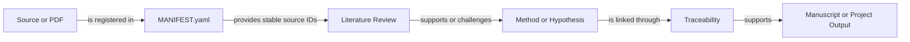

# Literature Corpus

## Purpose

This area maintains the repository-wide scientific source corpus, source verification state,
and literature syntheses. It is shared across work units; reused sources are referenced by
stable literature IDs rather than duplicated.

## Scope and Boundaries

### Owns

- One manifest entry per local or remotely referenced source.
- Local PDFs under `pdfs/` when the owner provides them.
- Verification state, provenance, checksum, and source role.
- Repository-wide and work-specific literature syntheses under `review/`.

### Does Not Own

- Manuscript prose or method specifications.
- Unverified bibliographic claims.
- Generated experimental evidence.
- Public redistribution rights for licensed PDFs.

## Inputs and Outputs

| Direction | Item | Source or Consumer | Contract |
|---|---|---|---|
| Input | PDF or source metadata | Owner or verified retrieval workflow | One manifest entry per source |
| Input | Reading status | Reviewer | Explicit verification level |
| Output | Literature manifest | Methods, reviews, and manuscripts | Stable `L-` IDs and traceable metadata |
| Output | Literature synthesis | Owner and work units | Organised by method family, assumptions, guarantees, and gaps |

## Structure and Key Elements

```text
myLiterature/
  MANIFEST.yaml
  pdfs/
  review/
    README.md
    <repository-wide synthesis>.md
    <work-slug>/
```

Verification states:

```text
metadata_only
abstract_reviewed
full_text_reviewed
full_text_verified
```

## Interfaces and Flow



## Configuration, Data, and State

- `MANIFEST.yaml` is tracked.
- Local PDFs are not committed by default.
- Filenames are repository-relative and descriptive.
- `used_by` records the work units that consume a source.
- `sha256` is required when a local PDF exists and may be `null` otherwise.
- `source_url` or another stable retrieval identifier should be provided when available.

## Validation and Failure Handling

| Concern | Validation | Failure Handling |
|---|---|---|
| Local PDF lacks a manifest entry | Manifest coverage check | Source is unavailable to downstream workflows |
| Duplicate literature ID | ID uniqueness check | Fail until one ID is reassigned |
| Strong claim relies on weak verification | Verification-state audit | Warn and require full-text review |
| Metadata or DOI is unverified | Metadata audit | Mark explicitly; never fabricate |
| Review uses unknown source ID | Cross-reference check | Treat the review claim as unsupported |

## Maintenance and Related Documentation

- Add or update the manifest whenever a source is introduced or re-verified.
- Never delete a source silently; record replacement or invalidation in the relevant review.
- Literature syntheses follow `review/README.md`.
- Active source-to-claim relationships are recorded in `REPO-INFO/TRACEABILITY.md`.
