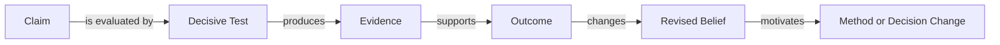

# Scientific Progression

## Purpose

This area preserves the append-only history of claims, decisive tests, outcomes, revised
beliefs, consequences, and computational or experimental cost. Failures and refutations are
first-class diagnostic records.

## Scope and Boundaries

### Owns

- Structured `P-` entries in the cumulative progression ledger.
- Work-specific live journals when an experiment workflow requires them.
- Links from outcomes to methods, experiments, evidence, and decisions.

### Does Not Own

- Current repository status.
- Method specifications.
- Raw metrics, logs, figures, or checkpoints.
- A publication plan whose contribution is only a negative result.

## Inputs and Outputs

| Direction | Item | Source or Consumer | Contract |
|---|---|---|---|
| Input | Verified test or experiment outcome | Tests, experiments, and artifacts | Evidence path must exist |
| Input | Claim or method ID | Traceability and methods | Stable identifier required |
| Output | Revised scientific belief | Methods, decisions, and future work | Observation separated from interpretation |
| Output | Failure diagnosis | Method design | Used to create a stronger method or architecture |

## Structure and Key Elements

```text
myProgression/
  00-scientific-progression.md
  journals/                       # created only when live journals are needed
```

Each cumulative entry uses a stable `P-` ID and structured fields rather than a wide
Markdown table.

## Interfaces and Flow



## Configuration, Data, and State

- `00-scientific-progression.md` is append-only.
- Live journals are not canonical evidence; they point to run artifacts.
- Outcome vocabulary should be explicit, for example `SUPPORTED`, `PARTIALLY_SUPPORTED`,
  `REFUTED`, `FALSIFIED`, `INCONCLUSIVE`, or `INVALID_TEST`.
- Evidence remains in `artifacts/` or test outputs.

## Validation and Failure Handling

| Concern | Validation | Failure Handling |
|---|---|---|
| Duplicate `P-` ID | ID uniqueness check | Fail and assign a new ID |
| Evidence path is missing | Path validation | Mark entry unverified |
| Observation and interpretation are conflated | Scientific review | Separate fields |
| Earlier entry is rewritten | Append-only audit | Restore history and append a new entry |

## Maintenance and Related Documentation

Append entries at work-unit closure or when a decisive result changes belief. Present-tense
state belongs in `STATUS.md`; active relationships belong in `REPO-INFO/TRACEABILITY.md`.
